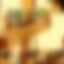

# Perceptual Similarity in Flax NNX

Port of the perceptual similarity metric (VGG16 only) in Flax's NNX module.
VGG16 weights ported from [torchvision.models](https://pytorch.org/vision/stable/models/generated/torchvision.models.vgg16.html#vgg16), linear weights from the original authors [github.com/richzhang/PerceptualSimilarity](https://github.com/richzhang/PerceptualSimilarity/blob/master/lpips/weights/v0.1/vgg.pth).

# Quick start
Run `pip install lpips-nnx`. To compare two images $x_0$ (heavy blur), $x_1$ (slight warp), with a reference $x_\text{ref}$,

|               $x_0$ |               $x_1$ |       $x_\text{ref}$ |
|---------------------|---------------------|----------------------|
|  |  |  |

you can run the following code:

```python
from PIL import Image

import jax.numpy as jnp
from lpips_nnx import LPIPS

lpips = LPIPS()
x0 = 2 * (np.array(Image.open("test/ex_p0"), dtype=np.float32) / 255.0) - 1
x1 = 2 * (np.array(Image.open("test/ex_p1"), dtype=np.float32) / 255.0) - 1
xref = 2 * (np.array(Image.open("test/ex_ref"), dtype=np.float32) / 255.0) - 1

d0, d1 = lpips(x0, xref), lpips(x1, xref)
assert d0.item() > d1.item()  # Assume the warp is more similar.
```

# Tests
To compare the results of this implementation with it's [reference](), first `pip install lpips`, and then run `pytest test/test.py`.

# Acknowledgements

This repository borrows partially from https://github.com/richzhang/PerceptualSimilarity, https://github.com/pcuenca/lpips-j, and https://github.com/CompVis/taming-transformers/blob/master/taming/modules/losses/lpips.py.